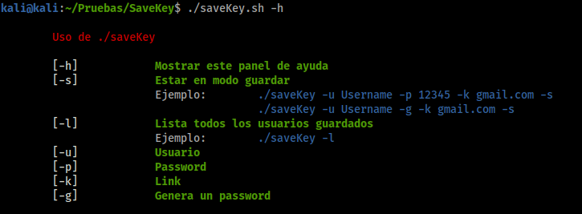
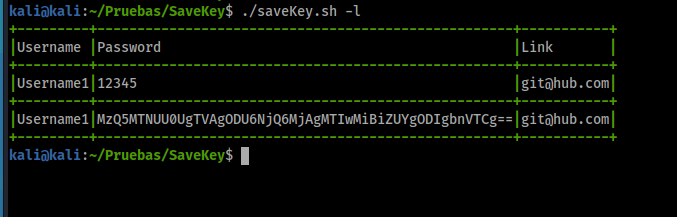

# saveKey
**saveKey** es un script hecho en bash, el cual nos ayuda a organizar mejor nuestras cuentas de distintos sitios web o otros. 

## ¿Cómo ejecutar la herramienta? 

1. Usando el comando **-h** (help)

    ```[bash]
    ./saveKey.sh -h
    ```
    

2. Guardando una cuenta

    ```
    ./saveKey.sh -u Username1 -p 12345 -k git@hub.com -s
    ```

3. Guardando una cuenta, usando **-g** el cual genera una contraseña

    ```
    ./saveKey.sh -u Username1 -g -k git@hub.com -s
    ```

4. Para listar las contraseñas guardadas **-l**

    ```
    ./saveKey.sh -l
    ```
     
